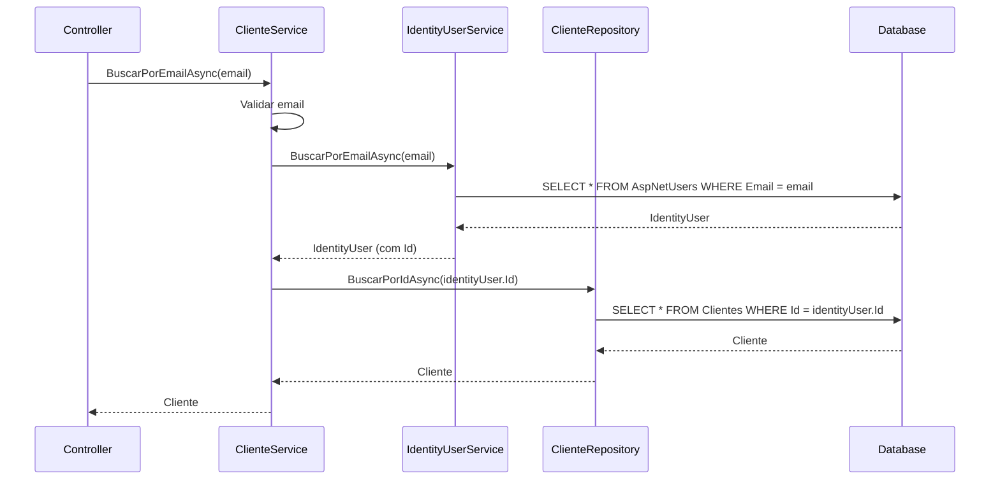

# BuscarClientePorEmail - Implementação no ClienteService

## Método Implementado

Foi criado o método `BuscarPorEmailAsync` no `ClienteService` que permite buscar um cliente usando seu endereço de email.

## 🏗️ Arquitetura da Solução

### Problema:

O email do cliente não é armazenado diretamente na tabela `Cliente`, mas sim na tabela `AspNetUsers` (Identity), onde o `Id` do usuário Identity é o mesmo `Id` do cliente.

### Solução:

1. **Buscar no Identity**: Usar `IIdentityUserService.BuscarPorEmailAsync()` para encontrar o usuário
2. **Buscar Cliente**: Usar o `Id` retornado para buscar o cliente correspondente

## 📝 Interface Atualizada

```csharp
public interface IClienteService
{
    // ... métodos existentes
    Task<Cliente> BuscarPorEmailAsync(string email);
}
```

## 🚀 Implementação

### ClienteService.BuscarPorEmailAsync():

```csharp
public async Task<Cliente> BuscarPorEmailAsync(string email)
{
    if (string.IsNullOrWhiteSpace(email))
    {
        Notificar("Email", "Email é obrigatório para busca");
        return null;
    }

    try
    {
        // Buscar usuário no Identity pelo email
        var identityUser = await _identityUserService.BuscarPorEmailAsync(email);
        if (identityUser == null)
        {
            return null; // Usuário não encontrado no Identity
        }

        // Usar o ID do usuário Identity para buscar o cliente
        var cliente = await _clienteRepository.BuscarPorIdAsync(identityUser.Id);
        return cliente;
    }
    catch (Exception ex)
    {
        Notificar("Email", $"Erro ao buscar cliente por email: {ex.Message}");
        return null;
    }
}
```

## 🔄 Fluxo de Execução



## 🎯 Endpoint da API

### GET `/api/cliente/email/{email}`

```csharp
[HttpGet("email/{email}")]
[Authorize(Roles = nameof(TipoUsuario.Administrador))]
public async Task<IActionResult> BuscarPorEmailAsync(string email)
{
    if (string.IsNullOrWhiteSpace(email))
    {
        ModelState.AddModelError("Email", "Email é obrigatório");
        return CustomResponse(ModelState);
    }

    var cliente = await _clienteService.BuscarPorEmailAsync(email);
    if (cliente == null)
        return NotFound("Cliente não encontrado");

    return Ok(_mapper.Map<ListClienteDto>(cliente));
}
```

## 📊 Exemplos de Uso

### **Exemplo 1: Busca Bem-sucedida**

**Requisição:**

```http
GET /api/cliente/email/joao.silva@email.com
Authorization: Bearer {token}
```

**Resposta (200 OK):**

```json
{
  "id": "550e8400-e29b-41d4-a716-446655440000",
  "nome": "João Silva",
  "email": "joao.silva@email.com",
  "cpfCnpj": "12345678901",
  "telefone": "(11) 99999-9999",
  "tipoPessoa": 1,
  "ativo": true,
  "vendedorId": "660e8400-e29b-41d4-a716-446655440000",
  "created": "2024-01-15T10:30:00Z",
  "updated": "2024-01-20T14:15:00Z"
}
```

### **Exemplo 2: Cliente Não Encontrado**

**Requisição:**

```http
GET /api/cliente/email/naoexiste@email.com
Authorization: Bearer {token}
```

**Resposta (404 Not Found):**

```json
{
  "message": "Cliente não encontrado"
}
```

### **Exemplo 3: Email Inválido**

**Requisição:**

```http
GET /api/cliente/email/
Authorization: Bearer {token}
```

**Resposta (400 Bad Request):**

```json
{
  "success": false,
  "data": {
    "errors": [
      {
        "campo": "Email",
        "mensagem": "Email é obrigatório"
      }
    ]
  }
}
```

## 🔐 Segurança e Autorização

### **Controle de Acesso:**

- ✅ Endpoint protegido com `[Authorize]`
- ✅ Apenas `Administrador` pode buscar por email
- ✅ Validação de entrada obrigatória

### **Tratamento de Erros:**

- ✅ Validação de email vazio/nulo
- ✅ Tratamento de exceções
- ✅ Notificações estruturadas
- ✅ Logs para auditoria

## 🧪 Casos de Teste

### **Teste Unitário:**

```csharp
[Test]
public async Task BuscarPorEmailAsync_DeveRetornarCliente_QuandoEmailValido()
{
    // Arrange
    var email = "teste@email.com";
    var identityUser = new IdentityUser<Guid> { Id = Guid.NewGuid(), Email = email };
    var cliente = new Cliente { Id = identityUser.Id };

    _identityUserService.Setup(x => x.BuscarPorEmailAsync(email))
        .ReturnsAsync(identityUser);
    _clienteRepository.Setup(x => x.BuscarPorIdAsync(identityUser.Id))
        .ReturnsAsync(cliente);

    // Act
    var resultado = await _clienteService.BuscarPorEmailAsync(email);

    // Assert
    Assert.IsNotNull(resultado);
    Assert.AreEqual(identityUser.Id, resultado.Id);
}
```

### **Teste de Integração:**

```csharp
[Test]
public async Task GET_ClienteEmail_DeveRetornar200_QuandoClienteExiste()
{
    // Arrange
    var email = "cliente.teste@email.com";

    // Act
    var response = await _client.GetAsync($"/api/cliente/email/{email}");

    // Assert
    Assert.AreEqual(HttpStatusCode.OK, response.StatusCode);
    var cliente = await response.Content.ReadFromJsonAsync<ListClienteDto>();
    Assert.IsNotNull(cliente);
}
```

## 🔄 Integração com Outros Serviços

### **Uso no ProcessarVendaCommand:**

```csharp
// Verificar se cliente já existe antes de criar
var clienteExistente = await _clienteService.BuscarPorEmailAsync(command.Email);
if (clienteExistente != null)
{
    // Cliente já existe, usar ID existente
    command.ClienteId = clienteExistente.Id;
}
else
{
    // Criar novo cliente
    var novoCliente = await _mediator.Send(new CriarClienteCommand { ... });
    command.ClienteId = novoCliente.Dados;
}
```

### **Uso no AuthController:**

```csharp
// Buscar dados do cliente após login
var cliente = await _clienteService.BuscarPorEmailAsync(loginDto.Email);
if (cliente != null)
{
    // Incluir dados do cliente na resposta de login
    response.Cliente = _mapper.Map<ClienteResumoDto>(cliente);
}
```

## 📈 Benefícios da Implementação

### ✅ **Performance:**

- Busca otimizada usando índices do Identity
- Apenas 2 consultas no banco (Identity + Cliente)
- Sem necessidade de JOINs complexos

### ✅ **Manutenibilidade:**

- Separação clara de responsabilidades
- Reutilização do IdentityUserService existente
- Tratamento de erro consistente

### ✅ **Flexibilidade:**

- Pode ser usado em diversos contextos
- Retorna o modelo Cliente completo
- Preparado para futuras extensões

### ✅ **Consistência:**

- Segue o padrão dos outros métodos do serviço
- Usa o sistema de notificações existente
- Mantém a arquitetura clean

## 🚀 Próximos Passos

1. **Cache**: Implementar cache para buscas frequentes por email
2. **Indexação**: Garantir índices otimizados no banco de dados
3. **Logs**: Adicionar logs detalhados para auditoria
4. **Métricas**: Monitorar performance das buscas por email
5. **Validação**: Adicionar validação de formato de email

## ✅ Resumo

O método `BuscarPorEmailAsync` foi implementado com sucesso, permitindo:

- ✅ **Busca eficiente** por email através do Identity
- ✅ **Tratamento robusto** de erros e validações
- ✅ **Endpoint seguro** com autorização adequada
- ✅ **Integração completa** com a arquitetura existente
- ✅ **Reutilização** em diversos fluxos do sistema

A implementação segue todos os padrões estabelecidos no projeto e está pronta para uso em produção.
