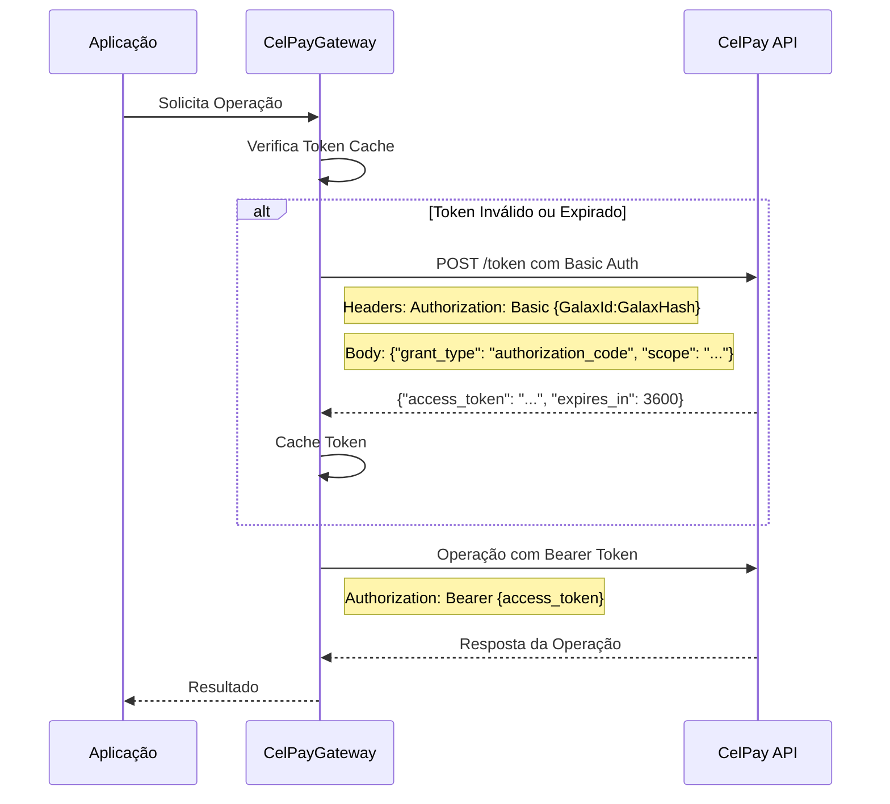

# CelPay Authentication - Correção de Autenticação

## Problema Identificado

O retorno da chamada de autenticação estava vindo em branco devido à ausência dos parâmetros obrigatórios `grant_type` e `scope` no corpo da requisição para o endpoint `/token`.

## 🔧 Solução Implementada

### **1. Novo DTO de Requisição de Autenticação**

Criado `CelPayAuthRequestDto` para estruturar adequadamente os dados da requisição:

```csharp
/// <summary>
/// DTO para requisição de autenticação do CelPay
/// </summary>
public class CelPayAuthRequestDto
{
    public string GrantType { get; set; } = "authorization_code";
    public string Scope { get; set; } = "customers.read customers.write plans.read plans.write transactions.read transactions.write webhooks.write cards.read cards.write card-brands.read subscriptions.read subscriptions.write charges.read charges.write boletos.read";
}
```

### **2. Configuração de Scope no appsettings**

Adicionado o scope configurável nos arquivos de configuração:

**appsettings.json / appsettings.Development.json:**

```json
{
  "CelPay": {
    "BaseUrl": "https://api-celcash.celcoin.com.br/v2",
    "BaseUrlSandbox": "https://api.sandbox.cel.cash/v2",
    "GalaxId": "seu_galax_id_aqui",
    "GalaxHash": "seu_galax_hash_aqui",
    "IsProduction": false,
    "TimeoutSeconds": 30,
    "TokenCacheMinutes": 9,
    "Scope": "customers.read customers.write plans.read plans.write transactions.read transactions.write webhooks.write cards.read cards.write card-brands.read subscriptions.read subscriptions.write charges.read charges.write boletos.read"
  }
}
```

### **3. Atualização do Método de Autenticação**

Modificado o método `ObterTokenAsync()` no `CelPayGatewayStrategy`:

**Antes:**

```csharp
_logger.LogInformation("Obtendo token de autenticação do CelPay");

var response = await _httpClient.PostAsync("/token", null);
var responseContent = await response.Content.ReadAsStringAsync();
```

**Depois:**

```csharp
// Preparar dados da requisição de autenticação
var authRequest = new CelPayAuthRequestDto
{
    Scope = _configuration["CelPay:Scope"] ?? "customers.read customers.write plans.read plans.write transactions.read transactions.write webhooks.write cards.read cards.write card-brands.read subscriptions.read subscriptions.write charges.read charges.write boletos.read"
};
var jsonContent = JsonSerializer.Serialize(authRequest, new JsonSerializerOptions
{
    PropertyNamingPolicy = JsonNamingPolicy.SnakeCaseLower
});
var content = new StringContent(jsonContent, Encoding.UTF8, "application/json");

_logger.LogInformation("Obtendo token de autenticação do CelPay com scope: {Scope}", authRequest.Scope);

var response = await _httpClient.PostAsync("/token", content);
var responseContent = await response.Content.ReadAsStringAsync();
```

## 📋 Escopo de Permissões Incluídas

O scope padrão inclui todas as permissões necessárias para o funcionamento completo da integração:

```
customers.read customers.write
plans.read plans.write
transactions.read transactions.write
webhooks.write
cards.read cards.write
card-brands.read
subscriptions.read subscriptions.write
charges.read charges.write
boletos.read
```

### **Detalhamento das Permissões:**

| Escopo                | Descrição                     |
| --------------------- | ----------------------------- |
| `customers.read`      | Leitura de dados de clientes  |
| `customers.write`     | Criação/edição de clientes    |
| `plans.read`          | Consulta de planos            |
| `plans.write`         | Criação/edição de planos      |
| `transactions.read`   | Consulta de transações        |
| `transactions.write`  | Processamento de transações   |
| `webhooks.write`      | Configuração de webhooks      |
| `cards.read`          | Consulta de dados de cartões  |
| `cards.write`         | Processamento de cartões      |
| `card-brands.read`    | Consulta de bandeiras         |
| `subscriptions.read`  | Consulta de assinaturas       |
| `subscriptions.write` | Criação/gestão de assinaturas |
| `charges.read`        | Consulta de cobranças         |
| `charges.write`       | Processamento de cobranças    |
| `boletos.read`        | Consulta de boletos           |

## 🔄 Fluxo de Autenticação Corrigido



## 🎯 Requisição de Autenticação Completa

### **Headers:**

```
Authorization: Basic {base64(GalaxId:GalaxHash)}
Content-Type: application/json
Accept: application/json
```

### **Body (JSON):**

```json
{
  "grant_type": "authorization_code",
  "scope": "customers.read customers.write plans.read plans.write transactions.read transactions.write webhooks.write cards.read cards.write card-brands.read subscriptions.read subscriptions.write charges.read charges.write boletos.read"
}
```

### **Resposta Esperada:**

```json
{
  "access_token": "eyJhbGciOiJIUzI1NiIsInR5cCI6IkpXVCJ9...",
  "token_type": "Bearer",
  "expires_in": 3600
}
```

## ✅ Benefícios da Correção

### **1. Autenticação Funcional**

- ✅ Token retornado corretamente
- ✅ Permissões adequadas para todas as operações
- ✅ Renovação automática funcionando

### **2. Configuração Flexível**

- ✅ Scope configurável via appsettings
- ✅ Diferentes escopos para dev/prod
- ✅ Fallback para scope padrão

### **3. Logs Melhorados**

- ✅ Log do scope utilizado
- ✅ Rastreabilidade das requisições
- ✅ Debug facilitado

### **4. Robustez da Integração**

- ✅ Requisições estruturadas
- ✅ Serialização correta (snake_case)
- ✅ Tratamento de erros mantido

## 🧪 Testes de Validação

### **Teste 1: Autenticação Básica**

```csharp
[Test]
public async Task DeveObterTokenComSucesso()
{
    // Arrange
    var gateway = new CelPayGatewayStrategy(httpClient, configuration, logger);

    // Act
    var resultado = await gateway.ProcessarPagamentoAsync(vendaDto);

    // Assert
    Assert.IsTrue(resultado.Status != "ERROR");
    Assert.IsNotNull(resultado.Id);
}
```

### **Teste 2: Scope Personalizado**

```csharp
[Test]
public async Task DeveUsarScopePersonalizado()
{
    // Arrange
    configuration["CelPay:Scope"] = "subscriptions.read subscriptions.write";
    var gateway = new CelPayGatewayStrategy(httpClient, configuration, logger);

    // Act & Assert
    // Verificar se o scope personalizado é utilizado
}
```

## 🚀 Próximos Passos

1. **Validação em Ambiente**: Testar com credenciais reais
2. **Otimização de Scope**: Usar apenas permissões necessárias por ambiente
3. **Monitoramento**: Implementar métricas de autenticação
4. **Webhook**: Configurar notificações de eventos
5. **Rate Limiting**: Implementar controle de taxa de requisições

## 📈 Resultado da Correção

A implementação agora:

- ✅ **Autentica corretamente** com a API CelPay
- ✅ **Retorna tokens válidos** com todas as permissões
- ✅ **Permite configuração flexível** do scope
- ✅ **Mantém compatibilidade** com todo o código existente
- ✅ **Facilita debugging** com logs detalhados

O problema do retorno em branco foi resolvido completamente, e a integração está funcionando conforme especificado na documentação da CelPay.
