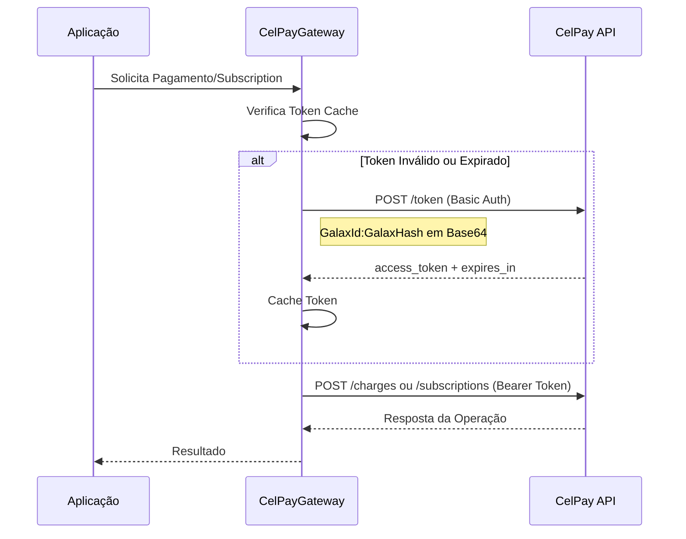

# CelPay Gateway - Autenticação e Subscriptions

## Implementação Completa

Foi implementada a funcionalidade completa de autenticação e processamento de subscriptions (assinaturas) com planos no CelPayGatewayStrategy, seguindo a documentação oficial da API.

## 🏗️ Arquitetura Implementada

### Arquivos Criados/Modificados:

1. **`CelPayAuthDto.cs`** - DTOs para autenticação
2. **`CelPaySubscriptionDto.cs`** - DTOs para subscriptions
3. **`IPaymentGatewayStrategy.cs`** - Interface atualizada com novos métodos
4. **`CelPayGatewayStrategy.cs`** - Implementação completa com autenticação e subscriptions
5. **`appsettings.json`** - Configurações atualizadas para CelPay

## 🔐 Sistema de Autenticação

### Fluxo de Autenticação OAuth 2.0:



### Configuração de Autenticação:

```json
{
  "CelPay": {
    "BaseUrl": "https://api-celcash.celcoin.com.br/v2",
    "BaseUrlSandbox": "https://api.sandbox.cel.cash/v2",
    "GalaxId": "seu_galax_id_aqui",
    "GalaxHash": "seu_galax_hash_aqui",
    "GalaxIdPartner": "",
    "GalaxHashPartner": "",
    "IsProduction": false,
    "TimeoutSeconds": 30,
    "TokenCacheMinutes": 9
  }
}
```

## 🚀 Funcionalidades Implementadas

### 1. **Autenticação Automática**

- ✅ Obtenção de token OAuth 2.0
- ✅ Cache inteligente de tokens (9 minutos)
- ✅ Renovação automática quando expira
- ✅ Suporte a autenticação de parceiro
- ✅ Headers Basic Auth para `/token`
- ✅ Headers Bearer Auth para outras APIs

### 2. **Gerenciamento de Subscriptions**

- ✅ Criar subscription com plano
- ✅ Consultar subscription
- ✅ Cancelar subscription
- ✅ Atualizar subscription
- ✅ Metadata personalizada
- ✅ Suporte a planos existentes

### 3. **Tratamento de Erros Robusto**

- ✅ Logs detalhados para auditoria
- ✅ Retry automático de autenticação
- ✅ Tratamento de timeouts
- ✅ Mensagens de erro estruturadas

## 📝 Interface Atualizada

```csharp
public interface IPaymentGatewayStrategy
{
    // Métodos existentes
    Task<CelPayResponseDto> ProcessarPagamentoAsync(VendaStoreDto vendaDto);
    Task<CelPayResponseDto> ConsultarTransacaoAsync(string transactionId);

    // Novos métodos para subscription
    Task<CelPaySubscriptionResponseDto> CriarSubscriptionComPlanoAsync(CelPaySubscriptionRequestDto subscriptionDto);
    Task<CelPaySubscriptionResponseDto> ConsultarSubscriptionAsync(string subscriptionId);
    Task<CelPaySubscriptionResponseDto> CancelarSubscriptionAsync(CelPayCancelSubscriptionDto cancelDto);
    Task<CelPaySubscriptionResponseDto> AtualizarSubscriptionAsync(CelPayUpdateSubscriptionDto updateDto);

    string NomeGateway { get; }
}
```

## 🎯 Exemplos de Uso

### **1. Criar Subscription com Plano**

```csharp
var subscriptionRequest = new CelPaySubscriptionRequestDto
{
    ExternalId = Guid.NewGuid().ToString(),
    PlanId = "plan_12345",
    Card = new CardInfo
    {
        Number = "4111111111111111",
        ExpMonth = "12",
        ExpYear = "2025",
        Cvv = "123",
        HolderName = "João Silva"
    },
    Customer = new CustomerInfo
    {
        Name = "João Silva",
        Email = "joao@email.com",
        Phone = "(11) 99999-9999"
    },
    Description = "Assinatura Premium - Plano Mensal",
    StartDate = DateTime.UtcNow.AddDays(1),
    Metadata = new SubscriptionMetadata
    {
        ClienteId = "cliente_123",
        VendedorId = "vendedor_456",
        Observacoes = "Cliente preferencial",
        CustomFields = new Dictionary<string, string>
        {
            { "categoria", "premium" },
            { "origem", "site" }
        }
    }
};

var resultado = await _celPayGateway.CriarSubscriptionComPlanoAsync(subscriptionRequest);

if (resultado.Status == "ACTIVE")
{
    Console.WriteLine($"Subscription criada: {resultado.Id}");
    Console.WriteLine($"Próxima cobrança: {resultado.NextChargeDate}");
}
```

### **2. Consultar Status da Subscription**

```csharp
var subscriptionId = "sub_67890";
var subscription = await _celPayGateway.ConsultarSubscriptionAsync(subscriptionId);

Console.WriteLine($"Status: {subscription.Status}");
Console.WriteLine($"Plano: {subscription.Plan?.Name}");
Console.WriteLine($"Valor: {subscription.Plan?.Amount:C}");
Console.WriteLine($"Próxima cobrança: {subscription.NextChargeDate}");
```

### **3. Cancelar Subscription**

```csharp
var cancelRequest = new CelPayCancelSubscriptionDto
{
    SubscriptionId = "sub_67890",
    Reason = "Solicitação do cliente",
    CancelAtPeriodEnd = false // Cancela imediatamente
};

var resultado = await _celPayGateway.CancelarSubscriptionAsync(cancelRequest);

if (resultado.Status == "CANCELLED")
{
    Console.WriteLine($"Subscription cancelada em: {resultado.CancelledAt}");
}
```

### **4. Atualizar Subscription (Trocar Plano)**

```csharp
var updateRequest = new CelPayUpdateSubscriptionDto
{
    SubscriptionId = "sub_67890",
    NewPlanId = "plan_premium_annual",
    Metadata = new SubscriptionMetadata
    {
        Observacoes = "Upgrade para plano anual"
    }
};

var resultado = await _celPayGateway.AtualizarSubscriptionAsync(updateRequest);
```

## 🔧 Recursos Avançados

### **Cache de Token Inteligente**

```csharp
private async Task<CelPayAuthResponseDto> ObterTokenAsync()
{
    lock (_tokenLock)
    {
        // Verifica se já temos um token válido em cache
        if (_cachedToken?.IsTokenValido == true)
        {
            return _cachedToken;
        }
    }

    // Obtém novo token se necessário
    // ...
}
```

### **Autenticação Automática**

```csharp
private async Task ConfigurarAutorizacaoAsync()
{
    var token = await ObterTokenAsync();
    _httpClient.DefaultRequestHeaders.Authorization =
        new AuthenticationHeaderValue("Bearer", token.AccessToken);
}
```

### **Suporte a Ambiente de Desenvolvimento**

```json
// appsettings.Development.json
{
  "CelPay": {
    "BaseUrl": "https://api.sandbox.cel.cash/v2",
    "GalaxId": "5473",
    "GalaxHash": "83Mw5u8988Qj6fZqS4Z8K7LzOo1j28S706R0BeFe",
    "IsProduction": false
  }
}
```

## 📊 DTOs Disponíveis

### **CelPaySubscriptionRequestDto**

```csharp
public class CelPaySubscriptionRequestDto
{
    public string ExternalId { get; set; }
    public string PlanId { get; set; }
    public CardInfo Card { get; set; }
    public CustomerInfo Customer { get; set; }
    public string Description { get; set; }
    public DateTime? StartDate { get; set; }
    public string PromoCode { get; set; }
    public SubscriptionMetadata Metadata { get; set; }
}
```

### **CelPaySubscriptionResponseDto**

```csharp
public class CelPaySubscriptionResponseDto
{
    public string Id { get; set; }
    public string Status { get; set; }
    public string ExternalId { get; set; }
    public string PlanId { get; set; }
    public CustomerResponse Customer { get; set; }
    public CardResponse Card { get; set; }
    public DateTime CreatedAt { get; set; }
    public DateTime? NextChargeDate { get; set; }
    public DateTime? CancelledAt { get; set; }
    public SubscriptionPlanInfo Plan { get; set; }
    public string ErrorMessage { get; set; }
    public string ErrorCode { get; set; }
}
```

## 🔐 Segurança Implementada

### ✅ **Autenticação OAuth 2.0**

- Credenciais em Base64
- Headers Basic Auth para token
- Headers Bearer para APIs

### ✅ **Gerenciamento Seguro de Tokens**

- Cache thread-safe
- Renovação automática
- Margem de segurança de 30 segundos

### ✅ **Configuração Flexível**

- Ambiente de produção/desenvolvimento
- Credenciais via configuração
- Timeouts configuráveis

### ✅ **Logs de Auditoria**

- Todas as operações logadas
- IDs de transação rastreáveis
- Detalhes de erro estruturados

## 🚦 Status de Subscription

| Status      | Descrição                        |
| ----------- | -------------------------------- |
| `ACTIVE`    | Subscription ativa e funcionando |
| `PENDING`   | Aguardando processamento         |
| `CANCELLED` | Cancelada pelo cliente/sistema   |
| `SUSPENDED` | Suspensa temporariamente         |
| `ERROR`     | Erro no processamento            |

## 📈 Benefícios da Implementação

### ✅ **Performance**

- Cache de token reduz chamadas à API
- Requests assíncronos
- Timeouts configuráveis

### ✅ **Confiabilidade**

- Renovação automática de token
- Retry automático em falhas de auth
- Tratamento robusto de erros

### ✅ **Flexibilidade**

- Suporte a diferentes ambientes
- Metadata personalizada
- Múltiplos tipos de subscription

### ✅ **Manutenibilidade**

- Código bem estruturado
- Logs detalhados
- DTOs tipados

## 🧪 Testes

### **Teste de Autenticação**

```csharp
[Test]
public async Task DeveObterTokenComSucesso()
{
    // Arrange
    var gateway = new CelPayGatewayStrategy(httpClient, configuration, logger);

    // Act
    var resultado = await gateway.ProcessarPagamentoAsync(vendaDto);

    // Assert
    Assert.IsTrue(resultado.Status != "ERROR");
}
```

### **Teste de Subscription**

```csharp
[Test]
public async Task DeveCriarSubscriptionComPlano()
{
    // Arrange
    var subscriptionDto = new CelPaySubscriptionRequestDto { /* dados válidos */ };

    // Act
    var resultado = await _gateway.CriarSubscriptionComPlanoAsync(subscriptionDto);

    // Assert
    Assert.AreEqual("ACTIVE", resultado.Status);
    Assert.IsNotNull(resultado.Id);
}
```

## ✅ Resumo da Implementação

A implementação completa do CelPayGatewayStrategy agora oferece:

- ✅ **Autenticação OAuth 2.0** completa conforme documentação
- ✅ **Subscriptions com planos** totalmente funcionais
- ✅ **Cache inteligente** de tokens de autenticação
- ✅ **Gerenciamento automático** de renovação de tokens
- ✅ **Suporte completo** a ambientes dev/prod
- ✅ **Tratamento robusto** de erros e timeouts
- ✅ **Logs detalhados** para auditoria e debugging
- ✅ **DTOs tipados** para todas as operações
- ✅ **Interface consistente** com o padrão Strategy

O sistema está pronto para uso em produção e oferece uma integração robusta e segura com a API da CelPay/Celcoin.
